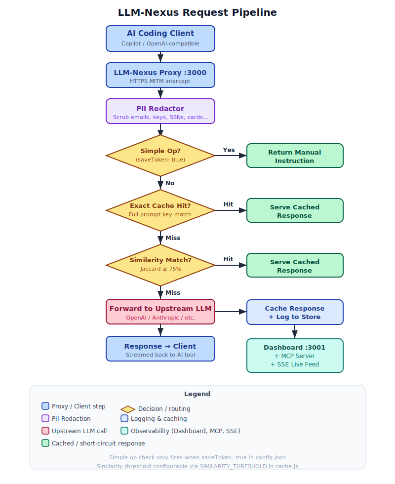

# LLM-nexus

[](https://nodejs.org)
[](https://github.com/saanvijay/LLM-nexus/actions)
[](https://app.codacy.com/gh/saanvijay/LLM-nexus)
[](https://securityscorecards.dev/viewer/?uri=github.com/saanvijay/LLM-nexus)
[](https://www.bestpractices.dev/projects/placeholder)
[](https://github.com/saanvijay/LLM-nexus/commits/main)

**LLM-Nexus** is a lightweight MITM proxy that sits between your AI coding tools (GitHub Copilot, any OpenAI-compatible client) and the upstream LLM. It provides:

- **Observability** — intercepts every request, logs prompts and completions with accurate BPE token counts, and streams everything to a real-time dashboard
- **Cost reduction** — serves repeated or similar prompts from an in-memory cache, skipping the upstream LLM call entirely
- **Privacy guardrails** — redacts PII (emails, API keys, SSNs, credit cards, and more) from every request before it is logged, cached, or forwarded
- **Agent integration** — exposes an MCP server so any MCP-compatible AI agent (Claude Desktop, custom agents) can query logs, stats, and cache as tools

---

## Project Structure

```
config/
├── config.json               # Proxy settings (port, logLevel, redactPII, etc.)
└── pii.config.json           # PII redaction rules — add or disable rules here

backend/
├── proxy/
│   ├── server.js             # Entry point — proxy + dashboard startup
│   ├── handler.js            # Request / response forwarding logic
│   └── certManager.js        # CA + per-host TLS cert generation & cache
├── dashboard/
│   ├── server.js             # HTTP server for dashboard UI + REST API (port 3001)
│   └── store.js              # In-memory log store with SSE broadcast
├── mcp/
│   └── server.js             # MCP stdio server — AI agent tool integration
└── utils/
    ├── logger.js             # Prompt/response extraction and log formatting
    ├── cache.js              # In-memory prompt cache (exact + similarity matching)
    ├── tokenizer.js          # Real BPE token counting via tiktoken
    ├── simpleOps.js          # Simple file-op detection and interception
    └── redactor.js           # PII guardrail — redacts sensitive data before forwarding

frontend/
└── index.html                # Observability dashboard (single-file, no build step)
```

## Request pipeline



> Source: [assets/flow-diagram.excalidraw](assets/flow-diagram.excalidraw) — open in [Excalidraw](https://excalidraw.com) to edit.

| Step | Action |
|---|---|
| 1 | **Simple-op check** — intercept immediately, return manual instruction *(if `saveToken: true`)* |
| 2 | **Exact cache hit** — replay stored response, skip LLM |
| 3 | **Similar cache hit** — replay best matching cached response, skip LLM |
| 4 | **Upstream LLM call** — forward request, cache response, push to dashboard store |

---

## Setup

**1. Install dependencies**

```bash
cd backend && npm install
```

**2. Start the proxy**

```bash
node proxy/server.js
```

This starts two servers simultaneously:
- **Proxy** on `http://localhost:3000` — intercepts all LLM traffic
- **Dashboard** on `http://localhost:3001` — observability UI + REST API

On first run a self-signed CA certificate is generated and saved to `backend/certs/`. The startup output prints the exact command to trust it.

**3. Trust the CA cert (macOS, run once)**

```bash
sudo security add-trusted-cert -d -r trustRoot \
  -k /Library/Keychains/System.keychain \
  backend/certs/ca.crt
```

**4. Tell Node.js about the CA cert**

Add to `~/.zprofile` (not `~/.zshrc` — GUI apps like VS Code don't read `~/.zshrc`):

```bash
export NODE_EXTRA_CA_CERTS="/Users/vijay/LLM-nexus/backend/certs/ca.crt"
```

Apply immediately:

```bash
launchctl setenv NODE_EXTRA_CA_CERTS "/Users/vijay/LLM-nexus/backend/certs/ca.crt"
```

**5. Export proxy env vars**

Add to `~/.zprofile`:

```bash
export HTTP_PROXY=http://localhost:3000
export HTTPS_PROXY=http://localhost:3000
```

> `HTTPS_PROXY` is required for LLM APIs — all Anthropic and OpenAI traffic is HTTPS. `HTTP_PROXY` alone will not intercept it.

Apply immediately:

```bash
launchctl setenv HTTP_PROXY "http://localhost:3000"
launchctl setenv HTTPS_PROXY "http://localhost:3000"
source ~/.zprofile
```

**6. VS Code setting** (catches anything Electron still rejects)

Add to VS Code `settings.json`:

```json
"http.proxyStrictSSL": false
```

**7. Restart VS Code** (Cmd+Q — not just close the window) so Copilot picks up all changes.

---

## Using with CLI tools (Claude CLI, curl, etc.)

GUI apps like VS Code pick up env vars from `launchctl`. CLI tools launched from a terminal only see what is exported in that shell session.

Before launching any CLI tool you want to intercept, export all three vars in the same terminal:

```bash
export HTTP_PROXY=http://localhost:3000
export HTTPS_PROXY=http://localhost:3000
export NODE_EXTRA_CA_CERTS="/Users/vijay/LLM-nexus/backend/certs/ca.crt"
claude   # or any other CLI
```

If you see **"SSL certificate verification failed"** with a CLI tool, the most common cause is that `NODE_EXTRA_CA_CERTS` is not set (or points to a stale path). Verify with:

```bash
echo $NODE_EXTRA_CA_CERTS
```

It must point to `backend/certs/ca.crt` inside this repo. If the path is wrong or empty, set it in the current shell before retrying.

---

## Observability Dashboard

Open `http://localhost:3001` in any browser after starting the proxy.

### Stats bar

| Metric | Description |
|---|---|
| Total Calls | All intercepted requests |
| Total Tokens | Cumulative tokens across all LLM calls |
| Cache Hits | Exact + similarity hits served from cache |
| Avg Latency | Mean round-trip time for upstream LLM calls |

### Filter tabs

- **All** — every intercepted event
- **LLM Calls** — upstream completions with full prompt/response detail
- **Cache Hits** — requests served from cache, including similarity score
- **Simple Ops** — file operations intercepted before reaching the LLM

### Detail panel

Clicking any entry in the list opens a detail panel showing:
- Model name, HTTP status, latency
- Token breakdown cards — System / Input / Output / Total
- Full system prompt, user input, and LLM output with syntax-highlighted sections

### Live feed

The dashboard connects to the proxy via Server-Sent Events and updates in real time without polling or page refresh. The green dot in the header indicates an active SSE connection.

---

## REST API

The dashboard server exposes a REST API on port 3001 that any HTTP client or agent can call.

| Method | Path | Description |
|---|---|---|
| `GET` | `/api/logs` | All stored log entries (newest first) |
| `GET` | `/api/logs?type=llm` | Filter by type: `llm`, `cache_hit`, `simple_op` |
| `GET` | `/api/logs?query=async` | Full-text search across all log fields |
| `GET` | `/api/logs?limit=20` | Limit result count (max 200) |
| `GET` | `/api/stats` | Aggregate statistics (calls, tokens, cache hits, latency) |
| `GET` | `/api/cache` | Cache entry count, similarity threshold, key previews |
| `DELETE` | `/api/cache` | Clear the entire prompt cache |
| `GET` | `/api/config` | Current proxy configuration |
| `GET` | `/api/stream` | SSE live feed of new log entries |

Parameters can be combined: `/api/logs?type=llm&query=async&limit=10`

---

## MCP Server (AI Agent Integration)

The MCP (Model Context Protocol) server lets any MCP-compatible AI agent — Claude Desktop, custom agents, or agent frameworks — call this proxy's functions as tools.

### Start the MCP server

```bash
node backend/mcp/server.js
```

The MCP server communicates over **stdio** (standard MCP convention) and talks to the dashboard REST API on `localhost:3001`. The proxy must be running first.

### Available tools

| Tool | Description |
|---|---|
| `get_logs` | Retrieve already-processed logs — filterable by `type`, `query`, `limit` |
| `get_stats` | Aggregate stats over processed requests: calls, tokens, cache hits, avg latency |
| `get_cache_info` | Cache entry count, similarity threshold, key previews |
| `search_logs` | Full-text search across already-processed log entries |

### Connect to Claude Desktop

Add to `~/.claude/claude_desktop_config.json`:

```json
{
  "mcpServers": {
    "llm-nexus": {
      "command": "node",
      "args": ["/Users/vijay/LLM-nexus/backend/mcp/server.js"]
    }
  }
}
```

Restart Claude Desktop. The tools will appear automatically under the llm-nexus server.

### Connect to any MCP-compatible agent

Any agent that supports the Model Context Protocol can connect by launching the server as a subprocess and communicating via stdin/stdout. The server name is `llm-nexus`, version `1.0.0`.

---

## Features

### Token counting

Every intercepted request is tokenised with [tiktoken](https://github.com/openai/tiktoken) — the same BPE tokeniser used by OpenAI models. Token counts are computed locally from the actual prompt and response text.

The model is read from the request body and the correct encoding is selected automatically:

| Model prefix | Encoding |
|---|---|
| `gpt-4o` | `o200k_base` |
| `gpt-4`, `gpt-3.5` | `cl100k_base` |
| `text-davinci` | `p50k_base` |
| Unknown | `cl100k_base` (fallback) |

### Prompt cache

Identical and similar prompts are served from an in-memory cache, skipping the upstream LLM call entirely.

**Exact match** — the full prompt text is the cache key. Same prompt → instant replay.

**Similarity match** — prompts are tokenised into word sets and compared with Jaccard similarity. Any prompt scoring ≥ 75% against a cached entry is a hit. The threshold is configurable via `SIMILARITY_THRESHOLD` in [backend/utils/cache.js](backend/utils/cache.js).

### Simple-op interception

Prompts describing trivial file-system operations are intercepted before reaching the LLM. Enabled only when `saveToken: true` is set in config (default: `false`).

| Prompt contains | Operation |
|---|---|
| `create/add/make a file` | Create / Add File |
| `delete/remove a file` | Delete / Remove File |
| `move file/directory` | Move File / Directory |
| `rename file/directory` | Rename File / Directory |
| `copy file/directory` | Copy File / Directory |
| `add a comment` | Add Comment |

### Log levels

Set `logLevel` in `config.json` or via the `LOG_LEVEL` environment variable.

| Level | Behaviour |
|---|---|
| `INFO` (default) | Only LLM calls — prompts, responses, cache hits, simple ops |
| `DEBUG` | Everything including raw HTTP traffic, telemetry, REST requests |

### PII Redaction

When `redactPII: true` is set in `config.json` (default), the proxy scrubs Personally Identifiable Information from every request **before** it is logged, cached, or forwarded upstream. The original value is never stored anywhere.

Rules are defined in [config/pii.config.json](config/pii.config.json). Each rule has:

| Field | Description |
|---|---|
| `name` | Canonical placeholder label, e.g. `EMAIL` → replaced with `[EMAIL]` |
| `aliases` | Alternative names to reference this rule (e.g. `emailAddress`, `email_address`, `mail`) |
| `description` | Human-readable explanation of what the rule detects |
| `pattern` | JSON-escaped regex pattern string |
| `flags` | Regex flags — `g`, `gi`, etc. |
| `enabled` | Set to `false` to skip a rule without deleting it |

#### Built-in rules

| Name | Aliases | Detects |
|---|---|---|
| `API_KEY` | `apiKey`, `api_key`, `token`, `secret` | OpenAI `sk-...`, Anthropic `sk-ant-...`, GitHub `ghp_/gho_/ghs_`, Bearer tokens |
| `CREDIT_CARD` | `creditCard`, `credit_card`, `cardNumber`, `card_number` | Visa, Mastercard, Amex, Discover 16-digit numbers |
| `BANK_ACCOUNT` | `bankAccount`, `bank_account`, `accountNumber`, `routingNumber` | Account/routing numbers preceded by a label |
| `SSN` | `ssn`, `socialSecurity`, `social_security`, `taxId`, `tax_id` | US Social Security Number (NNN-NN-NNNN) |
| `PASSPORT` | `passport`, `passportNumber`, `passport_number` | 1-2 uppercase letters + 6-9 digits |
| `EMAIL` | `email`, `emailAddress`, `email_address`, `mail` | Email addresses |
| `PHONE` | `phone`, `phoneNumber`, `phone_number`, `mobile`, `cell` | US and international phone numbers |
| `IP_ADDRESS` | `ipAddress`, `ip_address`, `ip`, `ipv4` | Public IPv4 (private ranges excluded) |
| `DATE_OF_BIRTH` | `dateOfBirth`, `date_of_birth`, `dob`, `birthday`, `birthDate` | DOB when labelled with `dob:`, `born on`, `birthday`, etc. |

#### Adding a custom rule

Append an entry to `pii.config.json`:

```json
{
  "name": "EMPLOYEE_ID",
  "aliases": ["employeeId", "employee_id", "empId"],
  "description": "Internal employee ID format EMP-XXXXXX",
  "pattern": "\\bEMP-\\d{6}\\b",
  "flags": "gi",
  "enabled": true
}
```

Restart the proxy for changes to take effect. No code changes required.

---

## Configuration

### config.json

Edit [config/config.json](config/config.json) for proxy-level settings:

| Key | Default | Env override | Description |
|---|---|---|---|
| `port` | `3000` | `PORT` | Proxy listen port |
| `host` | `localhost` | `HOST` | Proxy bind address |
| `requestTimeout` | `30000` | `REQUEST_TIMEOUT` | Upstream timeout (ms) |
| `logLevel` | `"INFO"` | `LOG_LEVEL` | `INFO` or `DEBUG` |
| `saveToken` | `false` | — | Enable simple-op interception |
| `redactPII` | `true` | — | Enable PII redaction guardrail |
| `upstreamProxy.host` | `null` | — | Hostname of the upstream (chained) proxy |
| `upstreamProxy.port` | `null` | — | Port of the upstream proxy |
| `upstreamProxy.auth` | `null` | — | Basic-auth credentials as `"user:password"`, or `null` |
| `defaultPorts.http` | `80` | — | Default HTTP port |
| `defaultPorts.https` | `443` | — | Default HTTPS port |

Dashboard port can be changed via the `DASHBOARD_PORT` environment variable (default `3001`).

### pii.config.json

Edit [config/pii.config.json](config/pii.config.json) to manage PII redaction rules. See the [PII Redaction](#pii-redaction) section for the full rule schema and built-in rule list.

---

## Testing

All tests live in [backend/tests/](backend/tests/) and are fully standalone — no proxy process needs to be running.

| Test file | What it covers | Tests |
|---|---|---|
| [test-proxy-chain.js](backend/tests/test-proxy-chain.js) | Upstream proxy chain (CONNECT tunnel + TLS) | 2 |
| [test-cache.js](backend/tests/test-cache.js) | In-memory prompt cache | 41 |
| [test-redactor.js](backend/tests/test-redactor.js) | PII redaction — all 9 rules | 78 |

Run all three:

```bash
node backend/tests/test-proxy-chain.js
node backend/tests/test-cache.js
node backend/tests/test-redactor.js
```

---

### Proxy chain — `test-proxy-chain.js`

Verifies the full upstream proxy-chain path without touching production config:

1. Spins up a local mini CONNECT proxy on a random port
2. Calls `openTunnel()` directly (same code path as `handler.js`)
3. TLS-wraps the raw socket and fires a real HTTPS GET to `httpbin.org/get`

```
[mini-proxy] listening on 127.0.0.1:<port>

Test 1: openTunnel() via mini-proxy → httpbin.org:443
  [mini-proxy] CONNECT httpbin.org:443
Test 2: TLS wrap + HTTPS GET https://httpbin.org/get
  status: 200

✓ Test 1 PASSED — mini-proxy received CONNECT tunnel request
✓ Test 2 PASSED — TLS + HTTPS request succeeded through chain

✅ Proxy chain is working.
```

> `upstreamProxy` in `config.json` does not need to be enabled.

---

### Prompt cache — `test-cache.js`

41 assertions across 7 sections:

| Section | What is tested |
|---|---|
| `getCacheKey` | All four prompt fields (`prompt`, `messages`, `inputs`, `input`), wrong content-type, malformed JSON, field priority |
| `set / get / size / clear / keys` | Basic CRUD, null on miss, key listing |
| Overwrite | Re-inserting same key replaces value and refreshes insertion order |
| `findSimilar` — strings | Exact score 1.0, near-identical hit (Jaccard ≥ 0.75), unrelated miss, empty cache |
| `findSimilar` — messages | OpenAI `messages[]` format flattened correctly for similarity |
| Best match selection | Returns highest-scoring entry when multiple candidates qualify |
| `MAX_SIZE` eviction | Cache stays ≤ 500 entries; oldest entry evicted; re-insert does not exceed limit |

---

### PII redactor — `test-redactor.js`

78 assertions covering all 9 built-in rules plus buffer-level behaviour:

| Section | What is tested |
|---|---|
| Rule loading | All rules compiled, `getRuleByName` by canonical name / alias / case-insensitive |
| `EMAIL` | Two matches in one string aggregated into one `found` entry with `count=2`; no false positives |
| `PHONE` | US formats matched; short numbers ignored |
| `SSN` | Valid format matched; `000-xx` and `9xx-xx` invalid prefixes excluded |
| `CREDIT_CARD` | Visa, Mastercard, Discover formats |
| `API_KEY` | OpenAI `sk-`, Anthropic `sk-ant-`, GitHub `ghp_` |
| `BANK_ACCOUNT` | `account:` and `routing #` label variants |
| `PASSPORT` | 1–2 uppercase letters + 6–9 digits |
| `IP_ADDRESS` | Public IPs matched; private ranges (`10.x`, `192.168.x`, `127.x`) excluded |
| `DATE_OF_BIRTH` | Four label variants matched; unlabelled dates not redacted |
| Multi-type | EMAIL + SSN + PHONE in one string, all redacted independently |
| `redactBuffer` no-ops | `null`, empty, non-JSON content-type, no-PII → original buffer reference returned |
| `redactBuffer` messages | String content, OpenAI block-content array, image blocks untouched |
| `redactBuffer` prompt | Plain `prompt` field redacted; `messages` + `prompt` both present |
| Idempotency | Double-redacting a placeholder does not double-wrap it |

---

## Troubleshooting

### Certificate signature failure

If you see `certificate signature failure`, the CA cert in the keychain no longer matches the key on disk:

```bash
# 1. Remove old certs
rm backend/certs/ca.crt backend/certs/ca.key

# 2. Remove old trusted cert from keychain
sudo security delete-certificate -c "LLM-Nexus Proxy CA" /Library/Keychains/System.keychain

# 3. Restart the server — new CA is generated automatically
node proxy/server.js

# 4. Trust the new CA
sudo security add-trusted-cert -d -r trustRoot \
  -k /Library/Keychains/System.keychain \
  backend/certs/ca.crt

# 5. Re-apply env vars and fully restart VS Code
launchctl setenv NODE_EXTRA_CA_CERTS "/Users/vijay/LLM-nexus/backend/certs/ca.crt"
```

### Error reference

| Error | Fetcher | Fix |
|---|---|---|
| `ERR_CERT_AUTHORITY_INVALID` | `electron-fetch` | macOS keychain trust (step 3) |
| `fetch failed` | `node-fetch` | `NODE_EXTRA_CA_CERTS` in `~/.zprofile` + `launchctl` (step 4) |
| `unable to verify first certificate` | `node-http` | `NODE_EXTRA_CA_CERTS` in `~/.zprofile` + `launchctl` (step 4) |
| `certificate signature failure` | `node-http` | Regenerate certs (see above) |
